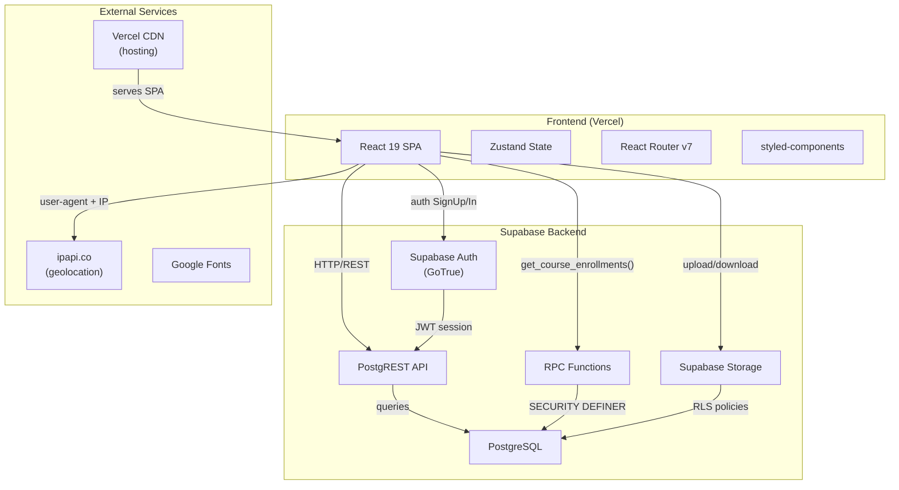
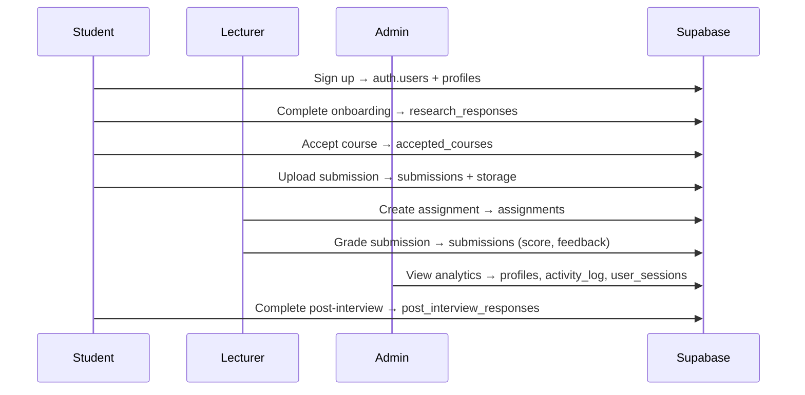

# System Architecture — TaTU Submission Portal

## High-Level Architecture

## Frontend Modules

| Module | Path | Purpose |
|---|---|---|
| Auth | `/login`, `/signup` | Email/password sign-in and registration |
| Onboarding | `/onboarding` | Pre-study research questionnaire (new students) |
| Dashboard | `/` | Role-switched home (student/lecturer/admin) |
| Courses | `/courses` | Browse catalog, accept/enroll in courses |
| Assignments | `/assignments` | Student view of assignments |
| Submissions | `/submissions` | File upload portal for assignments |
| History | `/history` | Submission history + CSV export |
| Settings | `/settings` | Profile, theme, notification preferences |
| Lecturer | `/lecturer/*` | Submissions grading, assignment management, student roster |
| Admin | `/admin`, `/analytics` | Research data dashboard, analytics |
| Post-Interview | `/post-interview` | Post-usage feedback survey |

## Route Guards (evaluated in order)

1. **CheckAuth** — redirects to `/login` if not authenticated
2. **OnboardingGuard** — redirects students with `onboarding_completed = false` to `/onboarding`
3. **RoleGuard** — restricts routes by role (`admin`, `lecturer`)
4. **DataLoader** — pre-loads courses, assignments, submissions, rubrics before rendering

## Data Flow

## Backend Services

| Service | Tables | Purpose |
|---|---|---|
| Supabase Auth | `auth.users` | Email/password authentication, JWT sessions |
| PostgreSQL | 11 public tables | All application data, RLS enforced |
| Storage | 3 buckets | File uploads (submissions, assignments, course images) |
| RPC | `get_course_enrollments()`, `get_course_students()` | Aggregation functions (SECURITY DEFINER) |

## Storage Buckets

| Bucket | Access | Limit | Purpose |
|---|---|---|---|
| `submission-files` | Private | 50 MB | Student assignment uploads |
| `assignment-files` | Public | 50 MB | Lecturer-uploaded materials |
| `course-images` | Public | 5 MB | Course thumbnails/banners |

## Security Layer

- **Row-Level Security (RLS)** enabled on every table
- **Role-based guards** on frontend routes (student / lecturer / admin)
- **`get_my_role()`** — SECURITY DEFINER function for RLS role checks (avoids infinite recursion)
- **`profile_role_guard`** — trigger preventing non-admins from assigning the admin role
- **Anon role** — all write privileges (INSERT/UPDATE/DELETE/TRUNCATE) revoked on every table
- **CSP headers** — strict Content-Security-Policy via `vercel.json`
- **Idle timeout** — auto-logout after 10 minutes of inactivity
- **Error sanitization** — raw Supabase errors mapped to user-friendly messages

## Tech Stack

| Layer | Technology |
|---|---|
| Frontend | React 19, Vite 8, styled-components, Zustand |
| Routing | React Router DOM v7 |
| Validation | Zod |
| Charts | Recharts |
| Icons | Lucide React |
| Sanitization | DOMPurify |
| Backend | Supabase (PostgreSQL 15, GoTrue, PostgREST, Storage) |
| Hosting | Vercel (production) |
| Repository | GitHub |
