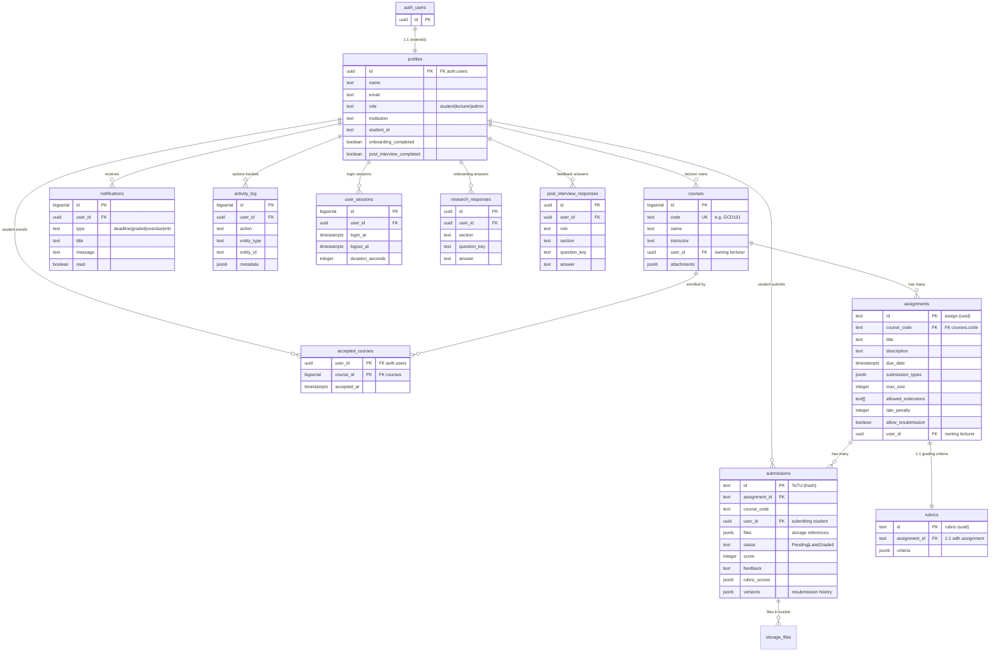

# Database Schema — TaTU Submission Portal

## Entity Relationship



## Tables Overview

| Table | Purpose | Key Relationships |
|---|---|---|
| `profiles` | User identity (extends auth.users) | 1:1 with auth.users; role determines access |
| `courses` | Course catalog | Owned by lecturer (`user_id`); identified by `code` |
| `assignments` | Assignment definitions | Belongs to course (`course_code`); owned by lecturer |
| `rubrics` | Grading criteria | 1:1 with assignment |
| `submissions` | Student submissions | Belongs to assignment + student; tracks versions |
| `accepted_courses` | Student-course enrollment | M:N join; blocks submission if not enrolled |
| `notifications` | User alerts | Deadline, grade, overdue, info types |
| `activity_log` | Action audit trail | All user actions for research/analytics |
| `user_sessions` | Login session tracking | Login/logout times, duration |
| `research_responses` | Pre-study questionnaire | Onboarding survey answers |
| `post_interview_responses` | Post-usage feedback | Post-interview survey answers |

## RLS Policy Summary

| Table | Student | Lecturer | Admin |
|---|---|---|---|
| `profiles` | Read/update own | Read/update own | Read/update/delete all |
| `courses` | Read all | CRUD own (`user_id`) | CRUD all |
| `assignments` | Read all | CRUD own (via course ownership) | CRUD all |
| `rubrics` | Read all | CRUD own | CRUD all |
| `submissions` | Insert (enrolled only), read own | Read/grade/delete own course submissions | Read/grade/delete all |
| `accepted_courses` | Manage own (`auth.uid() = user_id`) | — | — |
| `notifications` | Read/update own | Read/update own | Read/update own |
| `activity_log` | Insert own | Insert own | Read all, insert own |
| `user_sessions` | Read/insert/update own | Read/insert/update own | Read all, insert own |
| `research_responses` | Insert/read own | Insert/read own | Read all |
| `post_interview_responses` | Insert/read own | Insert/read own | Read all |

### Key RLS Mechanisms

- **`get_my_role()`** — SECURITY DEFINER function that reads the user's role from `profiles`. Used in policies to grant admin bypass without recursion.
- **`profile_role_guard`** — Trigger on `profiles` that prevents non-admin users from setting or changing the `role` column. Blocks privilege escalation.
- **Enrollment check** — `submissions` INSERT policy verifies the student has an `accepted_courses` row for the assignment's course. Blocks unauthorized submissions.
- **Anon revocation** — All write privileges (INSERT, UPDATE, DELETE, TRUNCATE) revoked from the `anon` role on every table. Unauthenticated requests fail immediately.

## Storage Buckets

| Bucket | Access | Limit | MIME Types | Path Structure |
|---|---|---|---|---|
| `submission-files` | Private | 50 MB | PDF, Word, PPT, Excel, text, CSV, ZIP, images, video | `{assignment_id}/{user_id}/filename` |
| `assignment-files` | Public | 50 MB | PDF, Word, PPT, Excel, text, CSV, ZIP, images | `{user_id}/filename` |
| `course-images` | Public | 5 MB | JPEG, PNG, GIF, WebP | `{user_id}/filename` |

### Storage RLS

- **submission-files**: Students upload/read own; lecturers read their course submissions; admins read all
- **assignment-files**: Lecturers/admins upload/delete own; anyone can read (public bucket)
- **course-images**: Lecturers/admins upload/update/delete; anyone can read (public bucket)

## Key Data Flows

### Submission Validation Chain

```
Student clicks "Submit"
  → submissions INSERT policy checks:
    1. auth.uid() = user_id (must be submitting as yourself)
    2. assignment exists
    3. assignment's course exists
    4. student has accepted_courses row for that course
  → If all pass: file uploaded to submission-files bucket
  → submission record created in submissions table
```

### Role Escalation Prevention

```
Non-admin tries to UPDATE profiles SET role = 'admin'
  → profile_role_guard trigger fires
  → Checks get_my_role() of the requesting user
  → If not admin: RAISE EXCEPTION 'Only administrators can assign roles'
  → Query blocked
```
